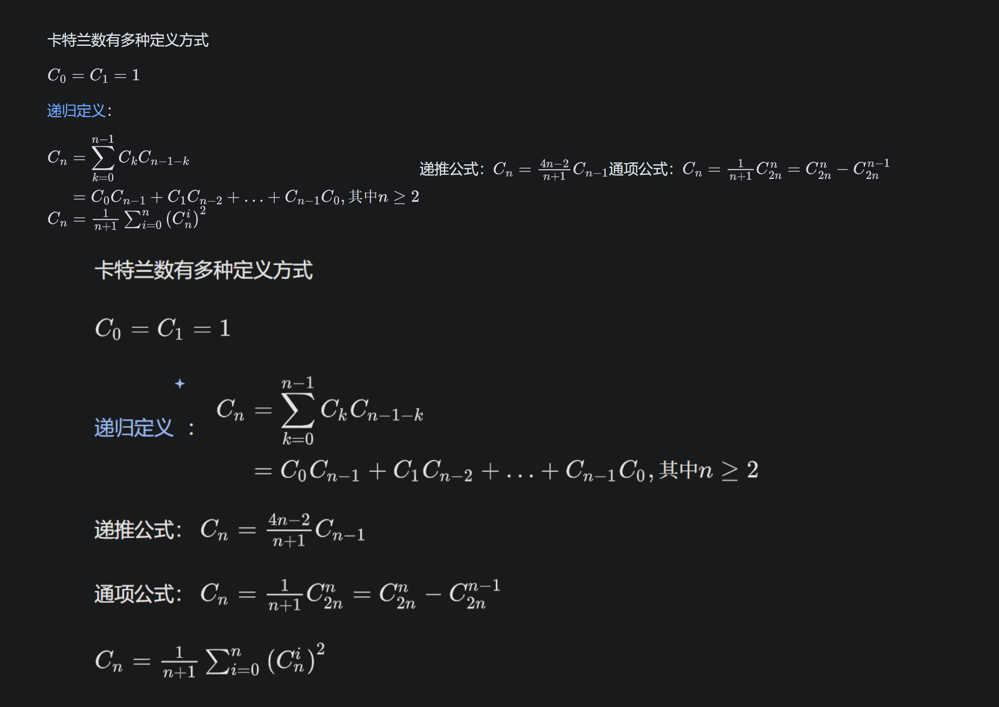

# Day 1 (2026/03/11)

v1.3.0: 不同的网站采用不同的转换方式，优化了codefoces
v1.3.1: 优化了codeforces的代码块内换行
v1.3.2: 不保留wiki引用上标
v1.3.3: 优化了表格内数学公式表示

v1.3.3的几个问题：知乎数学公式后换行有时会失效，[链接](https://zhuanlan.zhihu.com/p/385994583)

copy as md要工程化，不同网站的调试要隔离开来